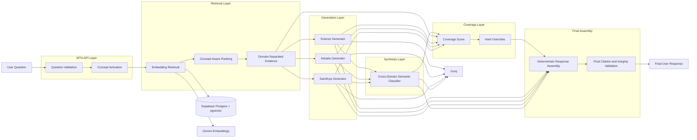
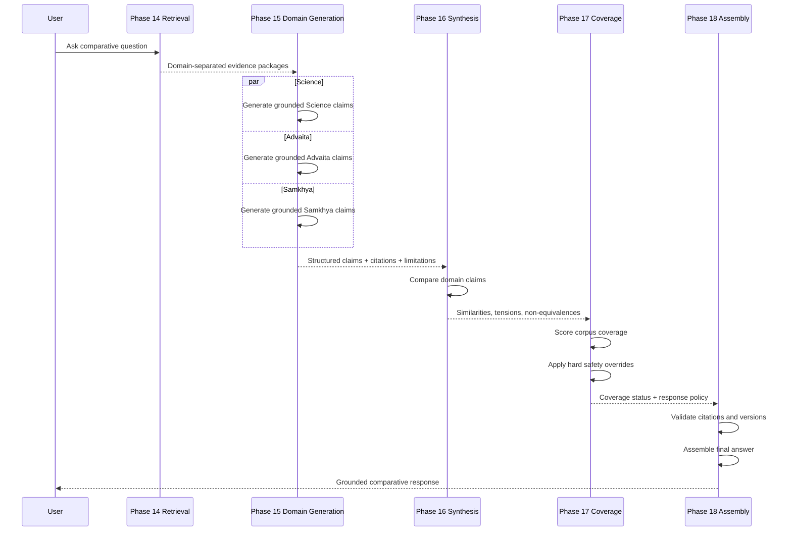
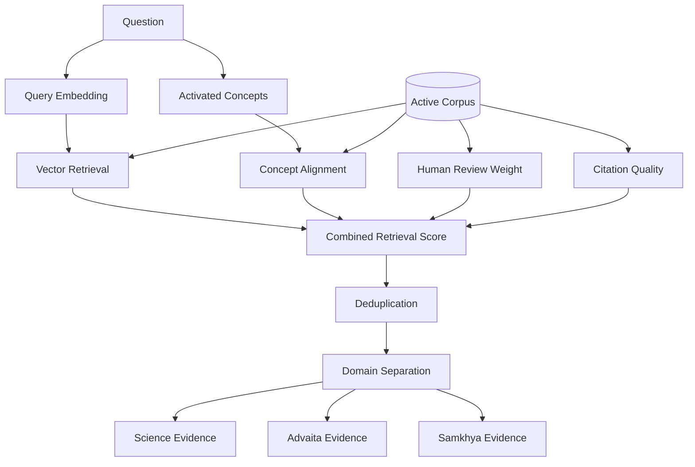
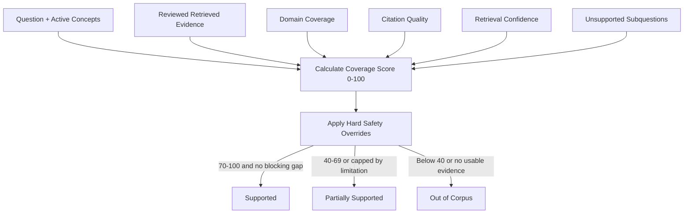
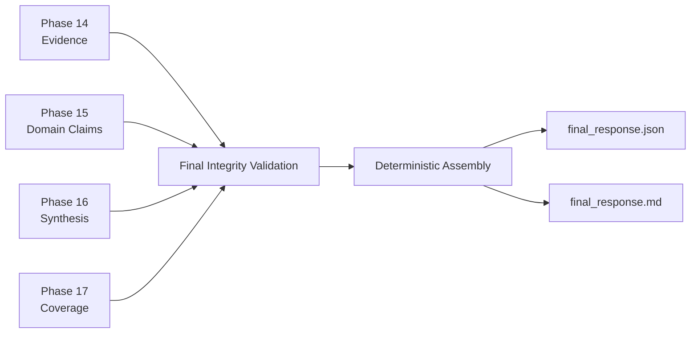
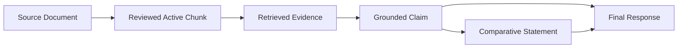
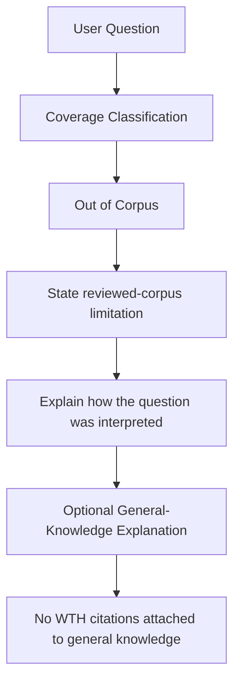

# WTH — What The Human

> A comparative, concept-aware retrieval and reasoning system for examining questions across **Science**, **Advaita Vedanta**, and **Samkhya** without collapsing their conceptual differences.

WTH (What The Human) is a research-oriented Retrieval-Augmented Generation (RAG) system designed to answer comparative questions about consciousness, selfhood, reality, mind, agency, causation, suffering, and related themes across multiple knowledge traditions.

The project is intentionally **not** a generic “retrieve a few passages and ask an LLM to summarize them” pipeline. Its core design goal is to preserve domain boundaries, keep claims traceable to reviewed evidence, distinguish similarity from equivalence, and explicitly identify when the active corpus does not contain enough evidence to answer a question reliably.

The current Phase 1 implementation focuses on a three-concept vertical slice:

- `consciousness`
- `self_identity`
- `reality_appearance`

across three domains:

- **Science**
- **Advaita Vedanta**
- **Samkhya**

---

## Table of Contents

1. [Project Goals](#project-goals)
2. [Why WTH Exists](#why-wth-exists)
3. [Core Design Principles](#core-design-principles)
4. [Current Scope](#current-scope)
5. [High-Level Architecture](#high-level-architecture)
6. [Runtime Request Flow](#runtime-request-flow)
7. [Phase Architecture](#phase-architecture)
8. [Concept Model](#concept-model)
9. [Corpus and Evidence Model](#corpus-and-evidence-model)
10. [Embedding Architecture](#embedding-architecture)
11. [Concept Mapping](#concept-mapping)
12. [Retrieval](#retrieval)
13. [Domain-Specific Generation](#domain-specific-generation)
14. [Cross-Domain Synthesis](#cross-domain-synthesis)
15. [Coverage Classification](#coverage-classification)
16. [Final Response Assembly](#final-response-assembly)
17. [Grounding and Citation Model](#grounding-and-citation-model)
18. [Safety and Non-Equivalence Rules](#safety-and-non-equivalence-rules)
19. [Repository Structure](#repository-structure)
20. [Technology Stack](#technology-stack)
21. [Local Development Setup](#local-development-setup)
22. [Environment Variables](#environment-variables)
23. [Database Setup](#database-setup)
24. [Running the API](#running-the-api)
25. [Running the Phase 1 Pipeline](#running-the-phase-1-pipeline)
26. [Generated Artifacts](#generated-artifacts)
27. [Validation and Quality Gates](#validation-and-quality-gates)
28. [Testing](#testing)
29. [Observability and Reproducibility](#observability-and-reproducibility)
30. [Production Behavior](#production-behavior)
31. [Known Limitations](#known-limitations)
32. [Roadmap](#roadmap)
33. [Design Decisions](#design-decisions)
34. [Contribution Guidelines](#contribution-guidelines)
35. [Project Status](#project-status)

---

# Project Goals

WTH is being built to answer questions such as:

- How is consciousness related to the self?
- Is experienced reality constructed, dependent, or independently real?
- How does the scientific model of self differ from Atman or Purusha?
- Where do Advaita and Samkhya genuinely disagree?
- When are two traditions only functionally analogous rather than substantively equivalent?
- What can the current reviewed corpus support, and what remains outside its coverage?

The system is designed to achieve five primary goals:

1. **Ground answers in reviewed source material.**
2. **Preserve the conceptual independence of each domain.**
3. **Support meaningful comparison without false equivalence.**
4. **Expose uncertainty and corpus limitations explicitly.**
5. **Maintain claim-level provenance from final answer back to active source chunks.**

---

# Why WTH Exists

Standard RAG systems are often strong at answering:

> “What does this corpus say about X?”

They are significantly weaker at answering:

> “How do three fundamentally different intellectual systems relate to X, and where do they agree, differ, or remain incomparable?”

A conventional RAG pipeline can easily make several mistakes:

- retrieve semantically similar but conceptually different passages;
- merge Atman and Purusha into a single “self” concept;
- turn functional analogy into metaphysical equivalence;
- present scientific findings as proof of philosophical claims;
- overgeneralize from sparse evidence;
- fabricate a polished answer when the corpus does not actually support the full question.

WTH is designed specifically around these failure modes.

---

# Core Design Principles

## 1. Evidence before generation

The LLM is not treated as the source of truth for corpus-grounded claims.

Reviewed corpus evidence is the authority.

## 2. Domain separation

Science, Advaita Vedanta, and Samkhya are retrieved and generated independently before any synthesis occurs.

## 3. Comparison after grounding

Cross-domain comparison is performed only after each domain has produced its own grounded claims.

## 4. Similarity is not equivalence

WTH distinguishes:

- surface similarity;
- functional analogy;
- substantive agreement;
- partial overlap;
- direct tension;
- non-equivalence;
- insufficient corpus coverage.

## 5. Human-reviewed evidence is authoritative

Automated embeddings and concept mapping assist retrieval, but reviewed labels and corpus status remain authoritative.

## 6. Corpus knowledge and model knowledge are separate

If a question is not adequately supported by the reviewed WTH corpus, the system may optionally provide a separately labeled general-knowledge explanation.

General knowledge must never be presented as reviewed-corpus evidence.

## 7. Reproducibility

Corpus versions, prompt versions, generation versions, thresholds, and intermediate artifacts are recorded so that a final answer can be traced back through the pipeline.

---

# Current Scope

## Phase 1 domains

| Domain | Purpose |
|---|---|
| Science | Empirical and scientific accounts relevant to consciousness, cognition, self-models, perception, and experienced reality |
| Advaita Vedanta | Non-dual Vedantic perspectives including Atman, Brahman, Maya, selfhood, and appearance |
| Samkhya | Classical dualist analysis involving Purusha, Prakriti, cognition, self, experience, and reality |

## Phase 1 concepts

| Concept ID | Human-readable meaning |
|---|---|
| `consciousness` | Awareness, conscious experience, subjectivity |
| `self_identity` | Self, identity, ego, subject, Atman/Purusha-related distinctions |
| `reality_appearance` | Reality, appearance, perception, Maya, Prakriti, experienced world |

## Canonical concept model

The broader architecture supports eight conceptual dimensions:

1. `consciousness`
2. `self_identity`
3. `reality_appearance`
4. `matter_mind`
5. `cosmology_origins`
6. `agency_free_will`
7. `causation_karma`
8. `moral_responsibility_suffering`

Only the first three are active in the current Phase 1 vertical slice.

---

# High-Level Architecture



---

# Runtime Request Flow

The production request path is intentionally staged.



Phases 17 and 18 make **no LLM calls**.

---

# Phase Architecture

The project is implemented as a controlled sequence of phases rather than a single opaque RAG function.

```mermaid
flowchart TD
    P0[Phase 0<br/>Preserve and Reclassify]
    P1[Phase 1<br/>Inspect Corpus Structure]
    P2[Phase 2<br/>Define Scope Metadata]
    P3[Phase 3<br/>Rule-Based Candidate Selection]
    P4[Phase 4<br/>Build Review Packet]
    P5[Phase 5<br/>Human Review]
    P6[Phase 6<br/>Freeze Build / Dev / Heldout]
    P7[Phase 7<br/>Select Embedding Architecture]
    P8[Phase 8<br/>Build Concept Prototypes]
    P9[Phase 9<br/>Generate Embeddings]
    P10[Phase 10<br/>Tune Concept Mapping]
    P11[Phase 11<br/>Heldout Evaluation]
    P12[Phase 12<br/>Reviewed Weighted Tags]
    P13[Phase 13<br/>Activate Corpus]
    P14[Phase 14<br/>Concept + Domain Retrieval]
    P15[Phase 15<br/>Domain-Specific Generation]
    P16[Phase 16<br/>Cross-Domain Synthesis]
    P17[Phase 17<br/>Coverage Classification]
    P18[Phase 18<br/>Final Response Assembly]
    P19[Phase 19<br/>End-to-End Testing]
    P20[Phase 20<br/>Phase Completion]

    P0 --> P1 --> P2 --> P3 --> P4 --> P5
    P5 --> P6 --> P7 --> P8 --> P9 --> P10
    P10 --> P11 --> P12 --> P13 --> P14
    P14 --> P15 --> P16 --> P17 --> P18
    P18 --> P19 --> P20
```



---

# Concept Model

WTH does not rely only on raw vector similarity.

Each active chunk can carry reviewed concept information and weighted concept associations.

A user question is transformed into:

- an embedding;
- an activated concept set;
- calibrated concept weights;
- ambiguity and unsupported-query signals.

Example:

```json
{
  "active_concepts": [
    "reality_appearance",
    "self_identity",
    "consciousness"
  ],
  "calibrated_weights": {
    "reality_appearance": 0.8068,
    "self_identity": 0.7749,
    "consciousness": 0.4846
  },
  "ambiguous": true,
  "unsupported": false
}
```

These values influence retrieval and later coverage analysis.

---

# Corpus and Evidence Model

## Corpus philosophy

The active corpus is not simply “all documents available.”

It is the subset of corpus chunks that have passed the Phase 1 review and activation process.

The active corpus therefore represents:

> reviewed evidence WTH is currently allowed to use for corpus-grounded claims.

## Phase 1 reviewed corpus

Current reviewed gold set:

- reviewed candidates: **424**
- approved active candidates: **318**
- excluded: **106**

Approved distribution:

| Domain | Approved chunks |
|---|---:|
| Science | 90 |
| Advaita Vedanta | 120 |
| Samkhya | 108 |
| **Total** | **318** |

The current active corpus version is:

```text
phase1_active_corpus_v1
```

## Human review

Human review is used to determine:

- whether a candidate belongs in the corpus;
- which concepts it supports;
- whether support is positive, partial, or negative;
- whether the candidate is a hard negative;
- whether source quality is sufficient;
- whether concept assignment requires override.

Human-reviewed labels override purely automated interpretation.

---

# Embedding Architecture

Phase 1 uses:

- **Provider:** Google Gemini API
- **Embedding model:** `gemini-embedding-2`
- **Embedding dimension:** `768`
- **Normalization:** L2 normalized
- **Similarity:** cosine similarity

## Document representation

```text
title: {title} | text: {content}
```

## Query representation

```text
task: search result | query: {content}
```

Concept prototypes and corpus chunks are embedded using the same embedding architecture.

---

# Concept Mapping

WTH uses a hybrid concept-mapping method.

The current frozen Phase 1 concept mapper combines:

- semantic embedding similarity;
- lexical concept cues;
- negative evidence;
- ambiguity handling;
- concept activation thresholds.

The mapper was tuned only on the development set.

The heldout set was reserved for final evaluation and is not reused for retuning.

This is important for preventing evaluation leakage.

---

# Retrieval

Phase 14 performs concept-aware, domain-separated retrieval.

The retrieval score combines:

| Signal | Weight |
|---|---:|
| Vector similarity | 0.55 |
| Concept alignment | 0.25 |
| Human review signal | 0.15 |
| Citation/source quality | 0.05 |

Additional retrieval controls include:

- source-repeat penalty;
- exact deduplication;
- near-duplicate Jaccard filtering;
- minimum vector similarity;
- per-domain evidence pool;
- per-domain final top-k;
- token budget per domain;
- maximum chunks per source;
- production-active corpus requirement.

Current key values:

```text
top_k per domain        = 3
candidate pool/domain   = 30
token budget/domain     = 900
max chunks/source       = 2
minimum vector score    = 0.20
source repeat penalty   = 0.08
```

## Retrieval architecture



---

# Domain-Specific Generation

Phase 15 generates three independent grounded responses.

The Science generator receives only Science evidence.

The Advaita generator receives only Advaita evidence.

The Samkhya generator receives only Samkhya evidence.

This prevents early conceptual contamination between domains.

## Phase 15 outputs

Each domain response contains:

- summary;
- structured claims;
- concepts covered;
- claim-level citations;
- limitations;
- unsupported aspects;
- grounding checks;
- domain-leakage validation.

The current Groq generation model is:

```text
llama-3.3-70b-versatile
```

Phase 15 uses structured JSON generation plus deterministic local validation.

Canonical citations are reconstructed locally from retrieved chunk IDs rather than trusted blindly from generated text.

---

# Cross-Domain Synthesis

Phase 16 compares already-grounded domain claims.

It does **not** receive the entire raw corpus again.

Its task is to classify relationships such as:

- surface similarity;
- functional analogy;
- substantive agreement;
- partial overlap;
- direct tension;
- non-equivalence;
- insufficient corpus coverage.

## Phase 16 responsibility split

Python owns:

- comparison slots;
- concepts;
- domain pairs;
- claim references;
- limitation references;
- citations;
- corpus version;
- structural integrity.

Groq owns:

- semantic relationship category;
- short comparative explanation.

This keeps Phase 16 lightweight and prevents the LLM from becoming a second provenance system.

## Example conceptual distinctions

WTH must preserve differences such as:

```text
Atman ≠ Purusha
```

```text
Scientific self-model ≠ metaphysical Self
```

```text
Perceptual construction ≠ proof of Maya
```

```text
Advaita dependent appearance ≠ Samkhya Prakriti
```

---

# Coverage Classification

Phase 17 asks:

> Does the reviewed WTH corpus contain enough evidence to answer the major components of this question?

It is intentionally stricter than stylistic validation because this phase controls whether WTH is allowed to present an answer as corpus-supported.

## Coverage workflow



## Coverage score

Current Phase 17 v2 weighting:

| Component | Points |
|---|---:|
| Activated concept strength | 25 |
| Retrieved evidence | 20 |
| Domain coverage | 20 |
| Citation quality | 15 |
| Retrieval confidence | 10 |
| Unsupported-subquestion component | 10 |
| **Total** | **100** |

## Coverage thresholds

```text
70–100  → Supported
40–69   → Partially Supported
0–39    → Unsupported / Out of Corpus
```

The score is followed by hard safety overrides.

Examples:

```text
No reviewed evidence
→ Out of Corpus
```

```text
No grounded Phase 15 claims
→ Out of Corpus
```

```text
Only one domain available for a three-domain comparison
→ cannot be fully Supported
```

```text
Phase 16 identifies insufficient comparison evidence
→ affected concept is capped at Partially Supported
```

## Example

For the question:

> How is consciousness related to the self and experienced reality?

the current Phase 1 evaluation produced approximately:

| Concept | Coverage score | Status |
|---|---:|---|
| `reality_appearance` | 88.21 | Supported |
| `self_identity` | 87.25 | Supported |
| `consciousness` | 74.54 | Partially Supported |

Overall:

```text
Coverage score: 84.64
Coverage status: Partially Supported
```

The overall status remains Partial because the consciousness comparison has an explicit Phase 16 coverage limitation.

---

# Final Response Assembly

Phase 18 is the deterministic presentation layer.

It does not call Groq, Gemini, or retrieval again.

It assembles validated outputs from Phases 14–17 into one final answer.

## Final response structure

1. Interpretation of the question
2. Activated concepts
3. Science perspective
4. Advaita Vedanta perspective
5. Samkhya perspective
6. Comparative synthesis
7. Key tensions and non-equivalences
8. Coverage classification
9. Claim-level citations

## Phase 18 architecture



## Final validation

Phase 18 checks:

- all Phase 15 claims have citations;
- citations resolve to Phase 14 retrieved active evidence;
- citation domain matches claim domain;
- Phase 15 domain-leakage validation passed;
- Phase 16 synthesis validation passed;
- obvious unsupported equivalence is rejected;
- Phase 17 coverage status matches concept statuses;
- Out-of-Corpus responses cannot masquerade as corpus-supported;
- corpus and prompt versions are recorded.

---

# Grounding and Citation Model

The citation chain is designed to remain inspectable.



A final corpus claim should therefore be traceable through:

```text
final claim
→ claim reference
→ canonical citation
→ chunk ID
→ source ID
→ active corpus version
```

This is one of the central architectural guarantees of WTH.

---

# Safety and Non-Equivalence Rules

WTH is intentionally conservative around comparative philosophical claims.

Hard or high-priority safeguards include:

## Domain leakage

Science evidence must not become Advaita evidence.

Advaita evidence must not become Samkhya evidence.

Samkhya evidence must not become Science evidence.

## Atman vs Purusha

WTH must not collapse Atman and Purusha into the same metaphysical entity.

Possible similarity or analogy may be discussed only when evidence supports it and the difference remains explicit.

## Science vs metaphysics

Scientific findings may illuminate:

- cognition;
- perception;
- self-modeling;
- conscious processing;
- neural mechanisms.

They must not automatically be treated as proof of:

- Brahman;
- Atman;
- Purusha;
- Maya;
- metaphysical non-duality;
- metaphysical dualism.

## General-knowledge fallback

When the reviewed corpus cannot adequately answer a question, the application may optionally return:

1. a clear corpus limitation;
2. an interpretation of the question;
3. a separately labeled general-knowledge explanation.

General knowledge must:

- not be labeled as corpus-supported;
- not reuse WTH corpus citations;
- not overwrite the coverage status.

---

# Repository Structure

A representative project layout is:

```text
WTH-WhatTheHuman/
│
├── apps/
│   └── api/
│       ├── clients/
│       ├── ingestion/
│       │   ├── chunkers/
│       │   └── parsers/
│       ├── models/
│       ├── routes/
│       ├── services/
│       └── main.py
│
├── artifacts/
│   └── phase1/
│       ├── reviewed/
│       ├── evaluation/
│       ├── embeddings/
│       ├── retrieval/
│       ├── generation/
│       ├── synthesis/
│       ├── coverage/
│       └── final/
│
├── data/
│   ├── catalogues/
│   └── concepts/
│
├── docs/
│   └── corpus/
│
├── packages/
│
├── scripts/
│   ├── freeze_phase1_candidate_corpus.py
│   ├── reclassify_phase1_candidate_corpus.py
│   ├── enrich_phase1_candidate_corpus_manifest.py
│   ├── select_phase1_vertical_slice.py
│   ├── freeze_phase1_evaluation_sets.py
│   ├── build_phase1_concept_prototypes.py
│   ├── generate_phase1_embeddings.py
│   ├── tune_phase1_concept_mapping.py
│   ├── calculate_reviewed_weighted_concept_tags.py
│   ├── build_phase1_retrieval.py
│   ├── build_phase1_domain_generation.py
│   ├── build_phase1_synthesis.py
│   ├── classify_phase1_coverage.py
│   └── assemble_phase1_final_response.py
│
├── supabase/
│   ├── migrations/
│   └── seed.sql
│
├── tests/
│
├── .env
├── .env.example
├── pyproject.toml
└── README.md
```

Actual repository contents may evolve as later phases are completed.

---

# Technology Stack

## Backend

- Python 3.11
- FastAPI
- Pydantic
- Uvicorn

## Database

- Supabase
- PostgreSQL
- pgvector

## Embeddings

- Google Gemini API
- `gemini-embedding-2`
- 768-dimensional vectors

## Generation

- Groq API
- current Phase 15/16 generation model: `llama-3.3-70b-versatile`

## Retrieval

- cosine vector similarity
- concept-aware reranking
- domain-separated evidence selection

## Quality

- Ruff
- mypy
- pytest
- GitHub Actions

---

# Local Development Setup

The project is currently developed primarily on Windows using PowerShell.

## Prerequisites

Install:

- Python 3.11
- Git
- Node.js / npm
- Supabase CLI through `npx`
- `uv`

Verify:

```powershell
python --version
uv --version
node --version
npx --version
```

Clone the repository:

```powershell
git clone <YOUR_REPOSITORY_URL>
cd WTH-WhatTheHuman
```

Create/install the environment:

```powershell
uv sync
```

If the project uses a local virtual environment directly:

```powershell
python -m venv .venv
.\.venv\Scripts\Activate.ps1
```

Then install dependencies according to `pyproject.toml`.

---

# Environment Variables

Never commit secrets.

A typical `.env` configuration includes variables such as:

```dotenv
APP_NAME=WTH-WhatTheHuman
APP_ENV=development
APP_VERSION=0.1.0
DEBUG=true
LOG_LEVEL=INFO

API_HOST=127.0.0.1
API_PORT=8000
API_PREFIX=/api

SUPABASE_URL=
SUPABASE_SECRET_KEY=
SUPABASE_PUBLISHABLE_KEY=

GROQ_API_KEY=
GROQ_MODEL=llama-3.3-70b-versatile
GROQ_TIMEOUT_SECONDS=
GROQ_MAX_RETRIES=

EMBEDDING_MODEL=gemini-embedding-2
EMBEDDING_DIMENSION=768
EMBEDDING_TIMEOUT_SECONDS=
EMBEDDING_MAX_RETRIES=

RETRIEVAL_TOP_K=
RETRIEVAL_MIN_SIMILARITY=

CONCEPT_ACTIVATION_THRESHOLD=
CONCEPT_AMBIGUITY_MARGIN=
MAX_ACTIVATED_CONCEPTS=

QUESTION_MIN_LENGTH=
QUESTION_MAX_LENGTH=

READINESS_CHECK_DATABASE=true
READINESS_CHECK_PROVIDERS=true
```

The exact environment contract is defined by the project settings model.

Do not copy production secrets into documentation, tests, or committed fixtures.

---

# Database Setup

The project uses Supabase Postgres and pgvector.

## Push migrations

```powershell
npx supabase db push
```

## Seed data

Use the repository's Supabase seed workflow.

For example:

```powershell
npx supabase seed
```

or use the exact command supported by the installed Supabase CLI version.

## Core data model

The database architecture supports entities such as:

- sources;
- source documents;
- chunks;
- concepts;
- weighted chunk-concept mappings;
- query-concept activations;
- retrieval results;
- claim citations;
- response concept coverage.

The schema also preserves concept-level traceability for query and response analysis.

---

# Running the API

Start the FastAPI service:

```powershell
uv run uvicorn apps.api.main:app --reload
```

If `uv` is unavailable in a shell, activate the local environment and use:

```powershell
python -m uvicorn apps.api.main:app --reload
```

Typical local endpoint:

```text
http://127.0.0.1:8000
```

Health and readiness routes should be used to verify:

- API process health;
- database connectivity;
- provider availability;
- embedding provider readiness;
- generation provider readiness.

---

# Running the Phase 1 Pipeline

The phase scripts should be executed in order because later phases depend on frozen outputs from earlier phases.

Exact CLI arguments can be inspected with:

```powershell
uv run python -m scripts.<module_name> --help
```

## Phase 14 — Retrieval

```powershell
uv run python -m scripts.build_phase1_retrieval
```

Produces concept-aware, domain-separated evidence.

## Phase 15 — Domain generation

```powershell
uv run python -m scripts.build_phase1_domain_generation --replace
```

Produces:

```text
artifacts/phase1/generation/domain_responses.json
artifacts/phase1/generation/generation_manifest.json
```

## Phase 16 — Synthesis

```powershell
uv run python -m scripts.build_phase1_synthesis --replace
```

Produces the cross-domain comparison matrix and synthesis artifacts.

## Phase 17 — Coverage classification

```powershell
uv run python -m scripts.classify_phase1_coverage --replace
```

Produces:

```text
artifacts/phase1/coverage/coverage.json
artifacts/phase1/coverage/coverage_manifest.json
```

Expected example:

```text
coverage_status=Partially Supported
coverage_score=84.64
supported_concepts=2
partially_supported_concepts=1
unsupported_concepts=0
covered_domains=3
missing_domains=0
Exit gate passed: True
```

## Phase 18 — Final response assembly

```powershell
uv run python -m scripts.assemble_phase1_final_response --replace
```

Produces:

```text
artifacts/phase1/final/final_response.json
artifacts/phase1/final/final_response.md
artifacts/phase1/final/final_response_manifest.json
```

Phase 18 should report:

```text
Phase 18 provider calls:
LLM=0 embedding=0 retrieval=0
```

because it only validates and assembles already-produced artifacts.

---

# Generated Artifacts

The pipeline intentionally creates inspectable intermediate artifacts.

Examples include:

```text
artifacts/phase1/reviewed/
artifacts/phase1/evaluation/
artifacts/phase1/embeddings/
artifacts/phase1/retrieval/
artifacts/phase1/generation/
artifacts/phase1/synthesis/
artifacts/phase1/coverage/
artifacts/phase1/final/
```

These artifacts are useful for:

- debugging;
- reproducibility;
- evaluation;
- auditability;
- regression analysis;
- comparing model/prompt versions;
- tracing final answers to evidence.

Large or sensitive generated artifacts should be governed by the repository's `.gitignore` and data-handling policy.

---

# Validation and Quality Gates

Every major phase has an exit gate.

A phase is not considered complete simply because the script executed.

## Phase 13

Active chunks must have reviewed production status and valid concept mappings.

## Phase 14

Retrieval must:

- use production-active evidence;
- preserve domain separation;
- preserve canonical citations;
- satisfy retrieval evaluation.

## Phase 15

Each domain response must:

- remain within its own domain;
- cite retrieved evidence;
- preserve corpus version;
- avoid unsupported evidence references.

## Phase 16

Synthesis must:

- include required comparison slots;
- use valid categories;
- preserve claim and citation provenance;
- reject obvious false equivalence;
- identify insufficient comparison coverage.

## Phase 17

Coverage must:

- calculate evidence support;
- apply hard overrides;
- prevent unsupported corpus claims;
- preserve corpus/general-knowledge boundaries.

## Phase 18

Final assembly must:

- include claim-level citations;
- resolve citations to active evidence;
- preserve domain integrity;
- preserve coverage policy;
- record versions.

---

# Testing

Run formatting:

```powershell
uv run ruff format .
```

Run linting:

```powershell
uv run ruff check .
```

Run type checking:

```powershell
uv run mypy .
```

Run tests:

```powershell
uv run pytest
```

A strong pre-commit workflow is:

```powershell
uv run ruff format .
uv run ruff check .
uv run mypy .
uv run pytest
```

---

# Observability and Reproducibility

WTH records version metadata throughout the pipeline.

Important identifiers include:

- corpus version;
- embedding model;
- embedding dimension;
- concept prototype version;
- concept-mapping configuration;
- retrieval configuration;
- generation version;
- generation prompt version;
- synthesis version;
- synthesis prompt version;
- coverage version;
- assembly version.

This enables a final response to be reconstructed from the exact pipeline configuration that produced it.

---

# Production Behavior

## Supported question

When corpus coverage is strong:

```text
User question
→ retrieve reviewed evidence
→ generate three grounded perspectives
→ synthesize differences
→ coverage = Supported
→ return complete cited answer
```

## Partially supported question

When meaningful evidence exists but one or more components are weak:

```text
User question
→ answer supported components
→ explicitly identify evidence gaps
→ do not invent missing corpus evidence
→ optionally provide labeled general context
```

## Out-of-corpus question



Example behavior:

> The reviewed WTH corpus does not currently contain enough evidence to answer this question reliably.
>
> I understand your question as asking...
>
> **General explanation:** ...
>
> This general explanation is not grounded in the reviewed WTH corpus.

---

# Known Limitations

## 1. Phase 1 concept scope is intentionally narrow

Only three concepts are active:

- consciousness;
- self/identity;
- reality/appearance.

Questions centered on agency, karma, cosmology, moral responsibility, or suffering may fall outside current reviewed coverage.

## 2. Corpus coverage is uneven

The corpus does not necessarily cover each topic equally across Science, Advaita, and Samkhya.

## 3. Heldout Science coverage limitation

The current heldout evaluation does not provide a complete basis for claiming generalization across the Science domain.

## 4. Purusha vs Atman remains a critical hard-negative area

Earlier heldout evaluation showed a meaningful tendency for automated concept mapping to incorrectly align Purusha with Atman/self.

The production design therefore treats this as an explicit non-equivalence risk.

## 5. OCR/source quality

Some historical source material may contain OCR degradation.

Reviewed activation is therefore important before source text becomes production evidence.

## 6. Coverage score is an operational support metric

The Phase 17 score measures how well the current reviewed corpus supports answering the question.

It should not be interpreted as philosophical, scientific, or metaphysical “proof.”

---

# Roadmap

## Current Phase 1

```text
Three domains
×
Three concepts
×
Reviewed active corpus
×
Concept-aware retrieval
×
Grounded generation
×
Comparative synthesis
×
Coverage classification
×
Final deterministic assembly
```

## Planned next work

### Phase 19 — End-to-End Testing

Test:

- Supported questions;
- Partially Supported questions;
- Out-of-Corpus questions;
- hard-negative cases;
- citation corruption;
- domain leakage;
- incomplete domain coverage;
- invalid synthesis references;
- general-knowledge fallback boundary.

### Phase 20 — Phase Completion

Freeze:

- Phase 1 corpus;
- retrieval configuration;
- prompt versions;
- coverage thresholds;
- validation behavior;
- final response contract.

## Future concept expansion

Potential future concepts include:

- matter and mind;
- cosmology and origins;
- agency and free will;
- causation and karma;
- moral responsibility and suffering.

Each new concept should repeat the same evidence discipline:

```text
source selection
→ human review
→ evaluation split
→ embedding/prototype construction
→ concept validation
→ corpus activation
→ retrieval evaluation
→ generation and synthesis testing
```

---

# Design Decisions

## Why not use one giant Groq prompt?

A single prompt containing all evidence from all domains would be simpler, but it would increase the risk of:

- domain leakage;
- conceptual collapse;
- citation mistakes;
- unsupported synthesis;
- difficult debugging.

WTH instead separates generation and synthesis.

## Why no LLM call in Phase 17?

Coverage classification is based on evidence already produced by earlier phases.

Using another LLM as a coverage judge would add:

- latency;
- cost;
- variability;
- another hallucination surface.

A deterministic score plus hard overrides is easier to inspect and test.

## Why no LLM call in Phase 18?

Phase 15 already generated grounded prose.

Phase 16 already generated comparative reasoning.

A final rewrite call could accidentally:

- remove citations;
- weaken domain separation;
- introduce new claims;
- create unsupported equivalence.

Phase 18 therefore performs deterministic validation and assembly.

## Why maintain intermediate artifacts?

Intermediate artifacts make it possible to ask:

> Why did the user receive this final answer?

and trace the result through:

```text
final response
→ Phase 18 assembly
→ Phase 17 coverage
→ Phase 16 synthesis
→ Phase 15 domain claims
→ Phase 14 evidence
→ active reviewed chunk
→ original source
```

That traceability is a central design feature, not an implementation side effect.

---

# Contribution Guidelines

When adding or modifying code:

1. Keep domain boundaries explicit.
2. Do not bypass reviewed corpus activation.
3. Do not tune on the heldout evaluation set.
4. Preserve deterministic provenance wherever possible.
5. Prefer local structural validation over additional LLM calls.
6. Avoid synonym or rule explosions unless evaluation demonstrates the need.
7. Treat unsupported evidence as a valid result, not a failure to be hidden.
8. Add tests for any new hard safety rule.
9. Run formatting, linting, type checking, and tests before merging.
10. Record any changed prompt, model, threshold, or corpus version.

Recommended quality gate:

```powershell
uv run ruff format .
uv run ruff check .
uv run mypy .
uv run pytest
```

---

# Project Status

Current Phase 1 status:

| Phase | Status |
|---|---|
| Phase 0 — Preserve / Reclassify | Complete |
| Phase 1 — Structure Inspection | Complete |
| Phase 2 — Scope Metadata | Complete |
| Phase 3 — Candidate Selection | Complete |
| Phase 4 — Review Packet | Complete |
| Phase 5 — Human Review | Complete |
| Phase 6 — Build / Dev / Heldout Freeze | Complete |
| Phase 7 — Embedding Architecture | Complete |
| Phase 8 — Concept Prototypes | Complete |
| Phase 9 — Embeddings | Complete |
| Phase 10 — Concept-Mapping Tuning | Complete |
| Phase 11 — Heldout Evaluation | Complete with documented limitations |
| Phase 12 — Reviewed Weighted Tags | Complete |
| Phase 13 — Active Corpus | Complete |
| Phase 14 — Retrieval | Complete |
| Phase 15 — Domain Generation | Complete |
| Phase 16 — Cross-Domain Synthesis | Complete |
| Phase 17 — Coverage Classification v2 | Complete / Frozen |
| Phase 18 — Final Response Assembly | Implemented; final real-run validation pending |
| Phase 19 — End-to-End Testing | Next |
| Phase 20 — Completion | Pending |

---

# Summary

WTH is built around a simple principle:

> **Do not confuse semantic similarity with conceptual equivalence, and do not confuse a plausible answer with a corpus-supported answer.**

The system therefore separates:

```text
retrieval
→ domain grounding
→ cross-domain reasoning
→ coverage classification
→ final deterministic assembly
```

while preserving claim-level provenance throughout.

The result is intended to be a comparative reasoning system that can say not only:

> “Here is what these traditions say,”

but also:

> “Here is where they genuinely overlap, where they differ, where comparison becomes misleading, and where the current reviewed corpus simply does not know enough yet.”
