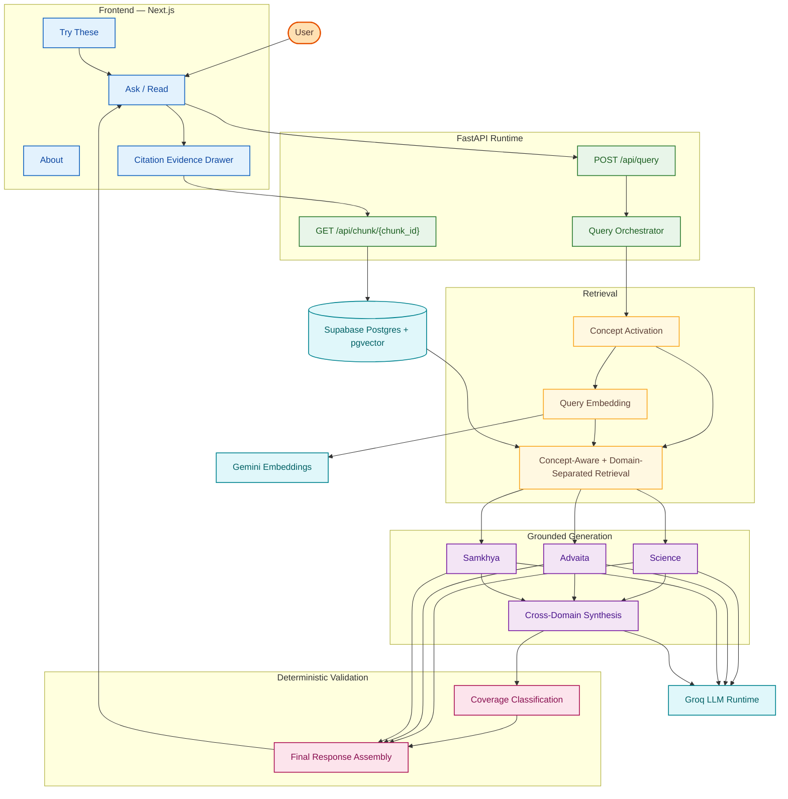
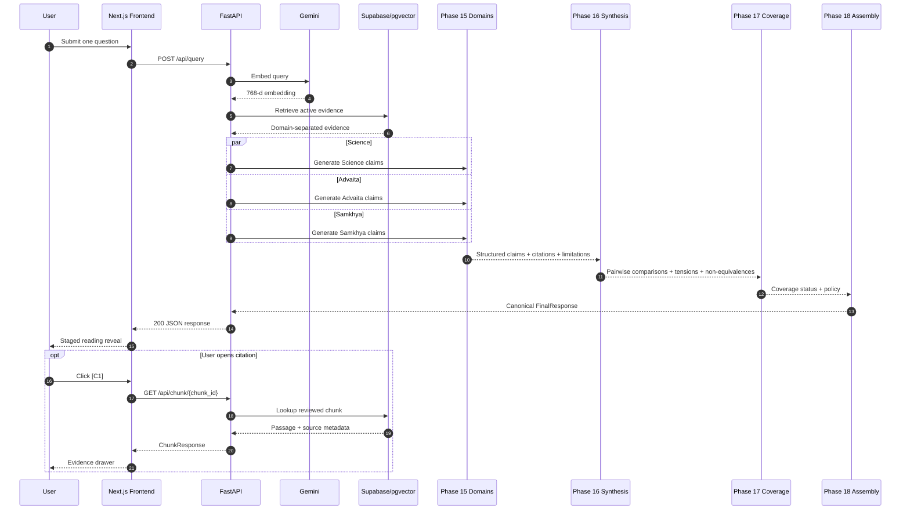
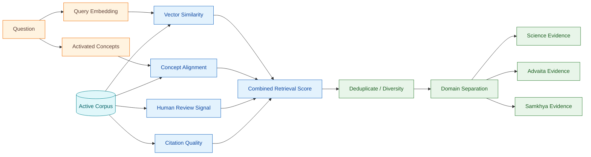
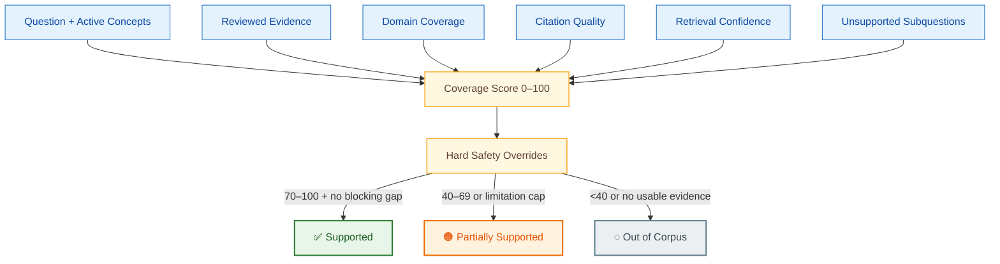
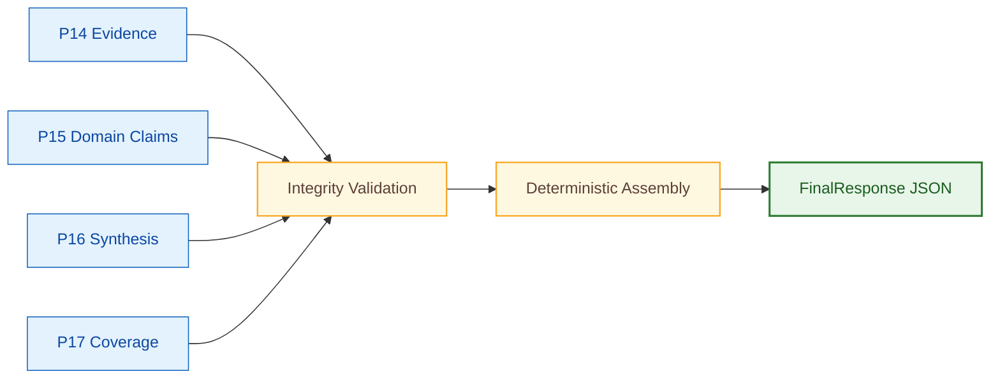

<div align="center">

# ✦ WTH — What The Human

### A citation-grounded comparative reasoning system for **Science**, **Advaita Vedanta**, and **Samkhya**

**Ask one difficult question. Read three independent perspectives. Inspect the evidence. Compare without collapsing differences.**

[Deployed](https://whatthehuman.netlify.app)  

</div>

---

## What WTH is

WTH (**What The Human**) is a concept-aware Retrieval-Augmented Generation (RAG) system for examining questions about **consciousness, selfhood, identity, perception, experienced reality, mind, agency, causation, suffering, and related themes** across three distinct knowledge traditions:

- **Science** — empirical and scientific literature
- **Advaita Vedanta** — non-dual Vedantic sources
- **Samkhya** — classical dualist analysis of Purusha, Prakriti, cognition, and experience

WTH is deliberately **not** a generic chatbot and not a “retrieve a few passages and ask one LLM to summarize everything” pipeline.

It is designed as a **reading experience**:

```text
one question
→ independently grounded domain responses
→ explicit comparison
→ coverage classification
→ inspectable citations and source passages
```

Its central design goal is simple:

> **Do not confuse semantic similarity with conceptual equivalence, and do not confuse a plausible answer with a corpus-supported answer.**

---

## Table of Contents

1. [Project Goals](#-project-goals)
2. [Why WTH Exists](#-why-wth-exists)
3. [Core Design Principles](#-core-design-principles)
4. [Current Scope](#-current-scope)
5. [Production Architecture](#-production-architecture)
6. [Runtime Request Flow](#-runtime-request-flow)
7. [Core Phase Architecture](#-core-phase-architecture)
8. [Concept Model](#-concept-model)
9. [Corpus and Evidence Model](#-corpus-and-evidence-model)
10. [Embedding Architecture](#-embedding-architecture)
11. [Concept Mapping](#-concept-mapping)
12. [Retrieval](#-retrieval)
13. [Domain-Specific Generation](#-domain-specific-generation)
14. [Cross-Domain Synthesis](#-cross-domain-synthesis)
15. [Coverage Classification](#-coverage-classification)
16. [Final Response Assembly](#-final-response-assembly)
17. [Grounding and Citation Model](#-grounding-and-citation-model)
18. [Safety and Non-Equivalence Rules](#-safety-and-non-equivalence-rules)
19. [Frontend Experience](#-frontend-experience)
20. [Public API Contract](#-public-api-contract)
21. [Repository Structure](#-repository-structure)
22. [Technology Stack](#-technology-stack)
23. [Local Development Setup](#-local-development-setup)
24. [Environment Variables](#-environment-variables)
25. [Database Setup](#-database-setup)
26. [Running the Backend](#-running-the-backend)
27. [Running the Frontend](#-running-the-frontend)
28. [Running the Phase 1 Pipeline](#-running-the-phase-1-pipeline)
29. [Generated Artifacts](#-generated-artifacts)
30. [Validation and Quality Gates](#-validation-and-quality-gates)
31. [Testing](#-testing)
32. [Observability and Reproducibility](#-observability-and-reproducibility)
33. [Production Behavior](#-production-behavior)
34. [Known Limitations](#-known-limitations)
35. [Design Decisions](#-design-decisions)
36. [Contribution Guidelines](#-contribution-guidelines)

---

# 🎯 Project Goals

WTH is built to answer questions such as:

- How is consciousness related to the self?
- Is experienced reality constructed, dependent, or independently real?
- How does the scientific model of self differ from Atman or Purusha?
- Where do Advaita and Samkhya genuinely disagree?
- When are two traditions only functionally analogous rather than substantively equivalent?
- What can the current reviewed corpus support, and what remains outside its coverage?

The system is designed around five goals:

1. **Ground answers in reviewed source material.**
2. **Preserve the conceptual independence of each domain.**
3. **Support comparison without manufacturing equivalence.**
4. **Expose uncertainty and corpus limitations explicitly.**
5. **Maintain claim-level provenance from final answer back to active source chunks.**

---

# Why WTH Exists

Standard RAG systems are often good at answering:

> “What does this corpus say about X?”

They are much weaker at answering:

> “How do three fundamentally different intellectual systems relate to X, and where do they agree, differ, or remain incomparable?”

A conventional RAG pipeline can easily:

- retrieve semantically similar but conceptually different passages;
- merge **Atman** and **Purusha** into one generic “self” concept;
- turn functional analogy into metaphysical equivalence;
- present scientific findings as proof of philosophical claims;
- overgeneralize from sparse evidence;
- generate a polished answer when the reviewed corpus does not actually support the full question.

WTH is designed around preventing exactly these failure modes.

---

# Core Design Principles

### 1. Evidence before generation

The LLM is not treated as the source of truth for corpus-grounded claims. Reviewed evidence is the authority.

### 2. Domain separation

Science, Advaita Vedanta, and Samkhya are retrieved and generated independently before any synthesis occurs.

### 3. Comparison after grounding

Cross-domain comparison happens only after each domain has produced its own grounded claims.

### 4. Similarity is not equivalence

WTH distinguishes:

- surface similarity;
- functional analogy;
- substantive agreement;
- partial overlap;
- direct tension;
- non-equivalence;
- insufficient corpus coverage.

### 5. Human-reviewed evidence is authoritative

Embeddings and automated concept mapping assist retrieval, but reviewed labels and activation status remain authoritative.

### 6. Corpus knowledge and model knowledge stay separate

If the reviewed corpus cannot support an answer, WTH can explicitly say so. Any optional general-knowledge explanation must remain visibly separate from corpus-grounded material.

### 7. Reproducibility matters

Corpus versions, prompt versions, model configuration, thresholds, retrieval configuration, and generated artifacts are recorded so that a final answer can be traced through the pipeline.

---

# Current Scope

## Active domains

| Domain | Purpose |
|---|---|
| **Science** | Empirical accounts relevant to consciousness, cognition, self-models, perception, and experienced reality |
| **Advaita Vedanta** | Non-dual Vedantic perspectives including Atman, Brahman, Maya, selfhood, and appearance |
| **Samkhya** | Classical dualist analysis involving Purusha, Prakriti, cognition, self, experience, and reality |

## Active Phase 1 concepts

| Concept ID | Human-readable meaning |
|---|---|
| `consciousness` | Awareness, conscious experience, subjectivity |
| `self_identity` | Self, identity, ego, subject, Atman/Purusha-related distinctions |
| `reality_appearance` | Reality, appearance, perception, Maya, Prakriti, experienced world |

## Broader canonical concept model

The wider architecture supports eight conceptual dimensions:

1. `consciousness`
2. `self_identity`
3. `reality_appearance`
4. `matter_mind`
5. `cosmology_origins`
6. `agency_free_will`
7. `causation_karma`
8. `moral_responsibility_suffering`

Only the first three are active in the current reviewed Phase 1 corpus.

---

# Production Architecture

WTH separates the browser experience from the reasoning backend. The frontend never talks directly to Supabase, Gemini, or Groq.



### Deployment topology

```text
Browser
  ↓
Next.js frontend — Netlify
  ↓ HTTPS
FastAPI backend — Render
  ├─ Supabase / pgvector
  ├─ Gemini embeddings
  └─ Groq generation + synthesis
```

Configured origins:

- Frontend: `https://whatthehuman.netlify.app`
- Backend: `https://wth-whatthehuman.onrender.com`

---

# Runtime Request Flow

The production request path is staged and non-streaming. `/api/query` returns one complete canonical response; the frontend reveal animation is only presentation pacing.



**Important:** Phases 17 and 18 make **no LLM calls**.

---

# Core Phase Architecture

The corpus and runtime are implemented as a controlled phase pipeline rather than one opaque RAG function.


---

# Concept Model

WTH does not rely only on raw vector similarity.

Each active chunk can carry reviewed concept information and weighted concept associations. A user question is transformed into:

- a query embedding;
- an activated concept set;
- calibrated concept weights;
- ambiguity signals;
- unsupported-query signals.

Example:

```json
{
  "active_concepts": [
    "reality_appearance",
    "self_identity",
    "consciousness"
  ],
  "calibrated_weights": {
    "reality_appearance": 0.8068,
    "self_identity": 0.7749,
    "consciousness": 0.4846
  },
  "ambiguous": true,
  "unsupported": false
}
```

These values influence retrieval and later coverage analysis.

---

# Corpus and Evidence Model

## Corpus philosophy

The active corpus is not simply “all documents available.”

It is the subset of chunks that passed the Phase 1 review and activation process.

> The active corpus represents reviewed evidence WTH is currently allowed to use for corpus-grounded claims.

## Reviewed Phase 1 corpus

- reviewed candidates: **424**
- approved active candidates: **318**
- excluded: **106**
- active source set: **10 sources**
- active concept relations: **954**

Approved distribution:

| Domain | Approved chunks |
|---|---:|
| Science | 90 |
| Advaita Vedanta | 120 |
| Samkhya | 108 |
| **Total** | **318** |

Current corpus version:

```text
phase1_active_corpus_v1
```

## Human review

Human review determines:

- whether a candidate belongs in the active corpus;
- which concepts it supports;
- whether support is positive, partial, or negative;
- whether the candidate is a hard negative;
- whether source quality is sufficient;
- whether concept assignment requires override.

Reviewed labels override purely automated interpretation.

---

# Embedding Architecture

Phase 1 uses:

- **Provider:** Google Gemini API
- **Model:** `gemini-embedding-2`
- **Dimension:** `768`
- **Normalization:** L2 normalized
- **Similarity:** cosine similarity

### Document representation

```text
title: {title} | text: {content}
```

### Query representation

```text
task: search result | query: {content}
```

Concept prototypes and corpus chunks use the same embedding architecture.

---

# Concept Mapping

WTH uses a hybrid mapping method combining:

- semantic embedding similarity;
- lexical concept cues;
- negative evidence;
- ambiguity handling;
- concept activation thresholds.

The mapper was tuned on the development set only. The heldout set was reserved for final evaluation and is not reused for retuning.

---

# Retrieval

Phase 14 performs concept-aware, domain-separated retrieval.

The retrieval score combines:

| Signal | Weight |
|---|---:|
| Vector similarity | 0.55 |
| Concept alignment | 0.25 |
| Human review signal | 0.15 |
| Citation/source quality | 0.05 |

Additional controls include:

- source-repeat penalty;
- exact deduplication;
- near-duplicate Jaccard filtering;
- minimum vector similarity;
- per-domain evidence pools;
- token budgets;
- maximum chunks per source;
- production-active corpus enforcement.



---

# Domain-Specific Generation

Phase 15 generates three independent grounded responses.

| Domain | Runtime model | Reasoning | Max completion |
|---|---|---|---:|
| Science | `openai/gpt-oss-20b` | medium | 2500 |
| Advaita Vedanta | `openai/gpt-oss-120b` | medium | 3000 |
| Samkhya | `openai/gpt-oss-20b` | medium | 2500 |

The Science generator receives only Science evidence, Advaita receives only Advaita evidence, and Samkhya receives only Samkhya evidence.

Each domain response contains:

- summary;
- structured claims;
- concepts covered;
- claim-level citation references;
- limitations;
- unsupported aspects;
- grounding checks;
- domain-leakage validation.

Canonical citations are reconstructed locally from retrieved evidence rather than blindly trusted from generated text.

---

# Cross-Domain Synthesis

Phase 16 compares already-grounded domain claims. It does **not** receive the raw corpus again.

Current synthesis configuration:

- **Model:** `openai/gpt-oss-120b`
- **Reasoning:** high
- **Max completion:** 4500

The synthesis layer classifies relationships such as:

- `surface_similarity`
- `functional_analogy`
- `substantive_agreement`
- `partial_overlap`
- `direct_tension`
- `non_equivalence`
- `insufficient_corpus_coverage`

### Responsibility split

**Python owns:**

- comparison slots;
- concepts;
- domain pairs;
- claim references;
- limitation references;
- citation references;
- corpus version;
- structural integrity.

**Groq-hosted LLM generation owns:**

- semantic relationship category;
- concise comparative explanation.

This prevents the LLM from becoming a second provenance system.

### Hard conceptual distinctions

```text
Atman ≠ Purusha
```

```text
Scientific self-model ≠ metaphysical Self
```

```text
Perceptual construction ≠ proof of Maya
```

```text
Advaita dependent appearance ≠ Samkhya Prakriti
```

---

# Coverage Classification

Phase 17 asks:

> Does the reviewed WTH corpus contain enough evidence to answer the major components of this question?

It is deterministic and intentionally stricter than stylistic validation.



Current Phase 17 v2 weighting:

| Component | Points |
|---|---:|
| Activated concept strength | 25 |
| Retrieved evidence | 20 |
| Domain coverage | 20 |
| Citation quality | 15 |
| Retrieval confidence | 10 |
| Unsupported-subquestion component | 10 |
| **Total** | **100** |

Thresholds:

```text
70–100  → Supported
40–69   → Partially Supported
0–39    → Out of Corpus
```

The numeric score is followed by hard overrides. A high raw score cannot override a blocking evidence gap.

---

# Final Response Assembly

Phase 18 is deterministic. It does not call Groq, Gemini, or retrieval again.

It assembles validated Phase 14–17 outputs into the canonical `FinalResponse` returned by `POST /api/query`.

The response includes:

1. interpretation of the question;
2. activated concepts;
3. Science perspective;
4. Advaita Vedanta perspective;
5. Samkhya perspective;
6. comparative synthesis;
7. key tensions;
8. non-equivalences;
9. coverage classification;
10. response-scoped claim-level citations;
11. validation metadata.



---

# Grounding and Citation Model

Citation references such as `C1` are **response-scoped**. They are never treated as permanent global identifiers.

The canonical frontend citation flow is:


A corpus-grounded claim can therefore be traced through:

```text
final claim
→ citation_ref
→ claim_level_citations registry
→ chunk_id
→ source_id
→ reviewed passage
→ active corpus version
```

The frontend never invents or infers a citation.

---

# Safety and Non-Equivalence Rules

WTH is intentionally conservative around comparative claims.

### Domain leakage

Science evidence must not become Advaita evidence. Advaita evidence must not become Samkhya evidence. Samkhya evidence must not become Science evidence.

### Atman vs Purusha

WTH must not collapse Atman and Purusha into the same metaphysical entity.

### Science vs metaphysics

Scientific findings may illuminate cognition, perception, self-modeling, conscious processing, and neural mechanisms. They must not automatically be treated as proof or disproof of Brahman, Atman, Purusha, Maya, non-duality, or metaphysical dualism.

### Functional analogy ≠ ontology

A useful similarity of role or function is not automatically a claim that two traditions mean the same thing.

### General-knowledge fallback

Any non-corpus explanation must be labeled as such and must never inherit WTH corpus citations.

---

# Frontend Experience

The frontend is a **reading interface, not a chat UI**.

Exactly three user-facing routes are implemented:

| Route | Purpose | Backend calls |
|---|---|---|
| `/` | Ask one question and read the full comparative response | `POST /api/query`, `GET /api/chunk/{chunk_id}` |
| `/try-these` | Five curated example questions | None |
| `/about` | Origin story, method, scope, limitations, stack | None |

### Reading sequence

```text
Question
→ Coverage indicator
→ Activated concepts
→ Interpretation
→ Science
→ Advaita Vedanta
→ Samkhya
→ Comparative synthesis
→ Important distinctions
→ Citation inspection
```

### Frontend design choices

- stacked domain panels on every breakpoint;
- EB Garamond for reading content and citations;
- restrained sans-serif UI chrome;
- Shatkona status animation;
- client-side staggered reveal after the complete response arrives;
- no SSE, WebSockets, or fake backend streaming;
- citation drawer for full evidence passages;
- calm Out-of-Corpus handling;
- no authentication, accounts, history, or multi-turn conversation in v1.

The frontend knows nothing about provider keys, Supabase internals, model names, or pipeline phases.

---

# Public API Contract

The production browser-facing API is intentionally small.

| Endpoint | Purpose |
|---|---|
| `POST /api/query` | Execute one complete WTH query and return canonical `FinalResponse` |
| `GET /api/chunk/{chunk_id}` | Retrieve one reviewed active corpus passage for a citation drawer |
| `GET /api/health` | Lightweight liveness endpoint |
| `GET /api/ready` | Runtime readiness/configuration check |

There is **no `/api/v1` prefix**.

### Query behavior

- request body: `{ "question": "..." }`
- question length: 3–1000 characters
- complete JSON response, not streamed
- Out of Corpus is a valid `200 OK` outcome
- controlled error responses include 413, 422, 429, 500, 502, 503, and 504

---

# Repository Structure

Representative current layout:

```text
WTH-WhatTheHuman/
│
├── apps/
│   └── api/
│       ├── clients/
│       ├── core/
│       ├── ingestion/
│       ├── middleware/
│       ├── models/
│       ├── routers/
│       ├── services/
│       └── main.py
│
├── frontend/
│   ├── app/
│   ├── components/
│   ├── contracts/
│   ├── data/
│   ├── lib/
│   ├── public/
│   ├── tests/
│   ├── types/
│   ├── package.json
│   └── package-lock.json
│
├── artifacts/
│   ├── frontend-contract/
│   └── phase1/
│       ├── reviewed/
│       ├── evaluation/
│       ├── embeddings/
│       ├── retrieval/
│       ├── generation/
│       ├── synthesis/
│       ├── coverage/
│       └── final/
│
├── data/
├── docs/
├── packages/
├── scripts/
├── supabase/
├── tests/
├── deploy/
├── Dockerfile
├── .dockerignore
├── netlify.toml
├── pyproject.toml
├── uv.lock
└── README.md
```

---

# Technology Stack

## Frontend

- Next.js 15
- App Router
- TypeScript
- Tailwind CSS
- Framer Motion
- EB Garamond
- Netlify deployment

## Backend

- Python 3.11
- FastAPI
- Pydantic
- Uvicorn
- Docker
- Render deployment

## Database / Retrieval

- Supabase
- PostgreSQL
- pgvector
- cosine vector similarity
- concept-aware reranking
- domain-separated evidence selection

## Embeddings

- Google Gemini API
- `gemini-embedding-2`
- 768-dimensional vectors

## Generation / Synthesis

- Groq API runtime
- `openai/gpt-oss-20b`
- `openai/gpt-oss-120b`

## Quality

- Ruff
- mypy
- pytest
- frontend lint / typecheck / tests / production build
- GitHub Actions

---

# Local Development Setup

The project is developed primarily on Windows using PowerShell.

## Prerequisites

- Python 3.11
- Git
- Node.js / npm
- Supabase CLI through `npx`
- `uv`

Verify:

```powershell
python --version
uv --version
node --version
npm --version
npx --version
```

Clone:

```powershell
git clone https://github.com/imAbhinav13/WTH-WhatTheHuman.git
cd WTH-WhatTheHuman
```

Install backend dependencies:

```powershell
uv sync
```

Install frontend dependencies:

```powershell
cd frontend
npm install
cd ..
```

---

## Backend — local example

```dotenv
APP_NAME=WTH: What The Human
APP_ENV=development
APP_VERSION=0.1.0
DEBUG=true
LOG_LEVEL=INFO

API_HOST=127.0.0.1
API_PORT=8000
API_PREFIX=/api
CORS_ORIGINS=http://localhost:3000

PROVIDER_MODE=live

SUPABASE_URL=
SUPABASE_SECRET_KEY=

GOOGLE_API_KEY=
GROQ_API_KEY=
GROQ_TIMEOUT_SECONDS=60
GROQ_MAX_RETRIES=3

EMBEDDING_MODEL=gemini-embedding-2
EMBEDDING_DIMENSION=768
EMBEDDING_TIMEOUT_SECONDS=30
EMBEDDING_MAX_RETRIES=3

RETRIEVAL_TOP_K=5
RETRIEVAL_MIN_SIMILARITY=0.55
CONCEPT_ACTIVATION_THRESHOLD=0.50
CONCEPT_AMBIGUITY_MARGIN=0.05
MAX_ACTIVATED_CONCEPTS=3

QUESTION_MIN_LENGTH=3
QUESTION_MAX_LENGTH=1000

LOG_FULL_QUESTION_TEXT=false
QUERY_RETENTION_DAYS=30

WTH_MAX_QUERY_BODY_BYTES=16384
WTH_QUERY_RATE_LIMIT_REQUESTS=5
WTH_QUERY_RATE_LIMIT_WINDOW_SECONDS=600
WTH_CHUNK_RATE_LIMIT_REQUESTS=60
WTH_CHUNK_RATE_LIMIT_WINDOW_SECONDS=60
```

## Frontend — local example

`frontend/.env.local`

```dotenv
NEXT_PUBLIC_WTH_API_BASE_URL=http://127.0.0.1:8000
NEXT_PUBLIC_WTH_GITHUB_URL=https://github.com/imAbhinav13/WTH-WhatTheHuman
```

No Groq, Gemini, or Supabase secret belongs in a `NEXT_PUBLIC_*` variable.

---

# 🗃️ Database Setup

WTH uses Supabase Postgres with pgvector.

Push migrations:

```powershell
npx supabase db push
```

Use the repository's seed workflow where required.

The database architecture supports entities such as:

- sources;
- source documents;
- chunks;
- concepts;
- weighted chunk-concept mappings;
- query-concept activations;
- retrieval results;
- claim citations;
- response concept coverage.

---

# Running the Backend

From the repository root:

```powershell
uv run uvicorn apps.api.main:app --host 127.0.0.1 --port 8000
```

Useful local endpoints:

```text
http://127.0.0.1:8000/api/health
http://127.0.0.1:8000/api/ready
http://127.0.0.1:8000/docs
```

The production Docker image binds to `0.0.0.0` and honors the platform-provided `PORT`.

---

# Running the Frontend

In a second terminal:

```powershell
cd frontend
npm install
npm run dev
```

Typical local frontend:

```text
http://localhost:3000
```

For real queries, the backend must also be running and reachable.

---

# Running the Phase 1 Pipeline

Phase scripts remain available for reproducibility, artifact inspection, and regression analysis.

Inspect module help with:

```powershell
uv run python -m scripts.<module_name> --help
```

Examples:

```powershell
uv run python -m scripts.build_phase1_retrieval
uv run python -m scripts.build_phase1_domain_generation --replace
uv run python -m scripts.build_phase1_synthesis --replace
uv run python -m scripts.classify_phase1_coverage --replace
uv run python -m scripts.assemble_phase1_final_response --replace
```

Phase 18 should perform:

```text
LLM=0
embedding=0
retrieval=0
```

because it validates and assembles already-produced artifacts.

---

# Generated Artifacts

The project intentionally preserves inspectable intermediate artifacts for:

- debugging;
- reproducibility;
- evaluation;
- auditability;
- regression analysis;
- model/prompt comparison;
- evidence traceability.

Examples:

```text
artifacts/phase1/reviewed/
artifacts/phase1/evaluation/
artifacts/phase1/embeddings/
artifacts/phase1/retrieval/
artifacts/phase1/generation/
artifacts/phase1/synthesis/
artifacts/phase1/coverage/
artifacts/phase1/final/
artifacts/frontend-contract/
```

Large or sensitive artifacts should remain governed by `.gitignore` and the project's data-handling policy.

---

# Validation and Quality Gates

Every major stage has an exit gate.

### Retrieval

Must use active reviewed evidence, preserve domain separation, preserve canonical citations, and satisfy retrieval evaluation.

### Domain generation

Must remain in-domain, cite retrieved evidence, preserve corpus version, and avoid unsupported references.

### Synthesis

Must preserve comparison slots, valid categories, claim/citation provenance, and hard non-equivalence rules.

### Coverage

Must prevent unsupported corpus claims and preserve Out-of-Corpus behavior.

### Final assembly

Must resolve citation references, preserve domain integrity, preserve coverage policy, and return a validated canonical response.

### Public API

Must preserve:

- exactly four public endpoints;
- no `/api/v1` prefix;
- controlled structured errors;
- production CORS;
- request size limits;
- rate limiting;
- secret-safe logging.

### Frontend

Must preserve:

- exactly three user-facing routes;
- no streaming;
- no direct provider/database access;
- response-scoped citation resolution;
- valid Out-of-Corpus rendering;
- production build success.

---

# Testing

Backend quality gates:

```powershell
uv run ruff format .
uv run ruff check .
uv run mypy .
uv run pytest
```

Frontend quality gates:

```powershell
cd frontend
npm run generate:api
npm run typecheck
npm run lint
npm test
npm run build
```

Frontend tests use captured contract fixtures and should not require live Groq/Gemini calls.

---

# 📊 Observability and Reproducibility

Important identifiers recorded through the pipeline include:

- corpus version;
- embedding model and dimension;
- concept prototype version;
- concept-mapping configuration;
- retrieval configuration;
- generation model and prompt version;
- synthesis model and prompt version;
- coverage version;
- assembly version.

Production request timing can include:

- `embedding_ms`
- `retrieval_ms`
- `generation_ms`
- `synthesis_ms`
- `coverage_ms`
- `assembly_ms`
- `total_ms`

The API can expose safe `Server-Timing`, request IDs, and controlled retry metadata without logging full questions or secrets.

---

# Production Behavior

## Supported

```text
question
→ reviewed evidence
→ three grounded perspectives
→ comparative synthesis
→ Supported
→ cited answer
```

## Partially Supported

```text
question
→ answer supported components
→ expose evidence gaps
→ retain limitations
→ Partially Supported
```

## Out of Corpus


Out of Corpus is a valid `200 OK` result, not an application failure.

---

# Known Limitations

### 1. Phase 1 concept scope is intentionally narrow

Only consciousness, self/identity, and reality/appearance are active in the reviewed corpus.

### 2. Corpus coverage is uneven

Not every topic is equally represented across Science, Advaita, and Samkhya.

### 3. Heldout Science coverage is limited

The current heldout evaluation is not sufficient to claim generalization across the Science domain as a whole.

### 4. Purusha vs Atman is a critical hard-negative area

The architecture therefore treats this as an explicit non-equivalence risk.

### 5. Historical source quality varies

Some older source material can contain OCR or text-encoding degradation. These issues should be fixed in corpus/source normalization rather than hidden by frontend string replacement.

### 6. Coverage is an operational support metric

The coverage score measures how well the reviewed corpus supports answering the question. It is not scientific, philosophical, or metaphysical “proof.”

### 7. Provider capacity can affect live completion

The runtime makes multiple structured generation calls. External provider throttling can produce controlled `429` or `502` outcomes even when the application itself is healthy.

---

# Design Decisions

## Why not use one giant prompt?

A single prompt containing all evidence from all domains would be simpler, but it would increase the risk of domain leakage, citation mistakes, conceptual collapse, unsupported synthesis, and difficult debugging.

WTH separates retrieval, domain generation, synthesis, coverage, and assembly.

## Why four LLM calls instead of one?

The architecture deliberately preserves:

1. Science generation;
2. Advaita generation;
3. Samkhya generation;
4. synthesis.

This keeps domain reasoning independent before comparison.

## Why no LLM in Phase 17?

Coverage is deterministic because another LLM judge would add cost, latency, variability, and another hallucination surface.

## Why no LLM in Phase 18?

A final rewrite call could remove citations, weaken domain boundaries, or introduce unsupported equivalence. Final assembly therefore remains deterministic.

## Why no true streaming in the frontend?

`POST /api/query` returns one atomic canonical response. The staged reveal is a client-side reading rhythm, not a representation of server-side arrival order.

## Why maintain intermediate artifacts?

They make it possible to trace:

```text
final response
→ assembly
→ coverage
→ synthesis
→ domain claims
→ retrieved evidence
→ active reviewed chunk
→ original source
```

That traceability is a core feature, not an implementation side effect.

---

# Contribution Guidelines

When modifying WTH:

1. Keep domain boundaries explicit.
2. Do not bypass reviewed corpus activation.
3. Do not tune on heldout evaluation data.
4. Preserve deterministic provenance wherever possible.
5. Prefer structural validation over additional LLM calls.
6. Avoid synonym/rule explosions unless evaluation demonstrates the need.
7. Treat unsupported evidence as a valid result.
8. Add tests for new safety rules.
9. Run backend and frontend quality gates before merging.
10. Record changed models, prompts, thresholds, or corpus versions.
11. Never expose Groq, Google, or Supabase secrets in browser code.
12. Keep citation references response-scoped and resolve them through the canonical registry.

---

<div align="center">

## ✦ The idea behind WTH

> **A useful comparative system should be able to say not only where ideas look similar, but where they differ, where comparison becomes misleading, and where the reviewed evidence simply does not know enough.**

</div>
